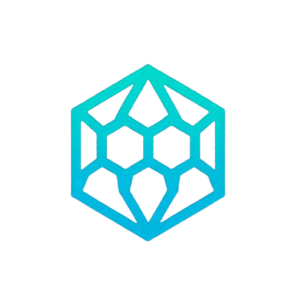
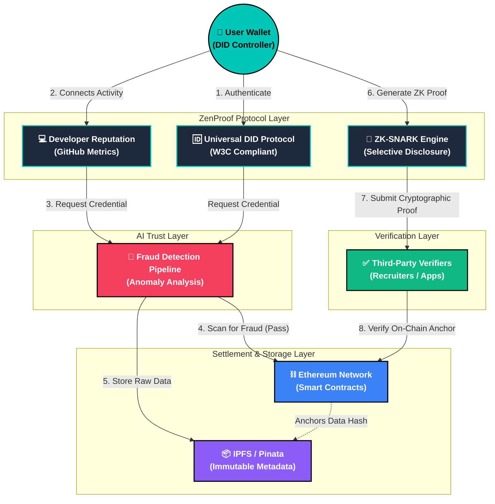
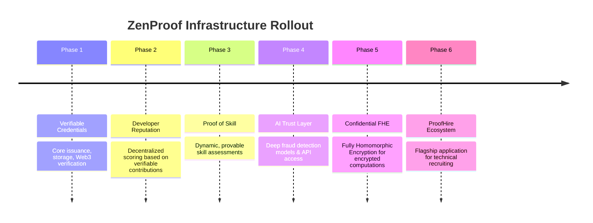

  

    

  # ZenProof

  **Privacy-Preserving Infrastructure for Verifiable Identity and Proof of Skill.**

   

  
  
  

---

## 🛑 The Problem

The global digital identity paradigm is broken. 
In the modern professional and educational ecosystem:

- **Resumes are heavily manipulated** and lack cryptographic backing.
- **Certificates can be easily forged**, requiring expensive manual verification.
- **Profiles can be faked** at scale, diluting the value of real accomplishments.
- **Credentials are difficult to verify** across international borders and non-standardized systems.
- **Users have surrendered control** over their personal data to centralized platforms that monetize their identity.

The world needs a trustless verification system.

---

## 💡 The Solution

**ZenProof is a decentralized trust layer that enables organizations, developers, institutions, and platforms to issue, verify, and selectively disclose credentials without exposing sensitive user information.**

By combining Decentralized Identifiers (DIDs), Zero-Knowledge Proofs (ZK-SNARKs), and Artificial Intelligence, ZenProof shifts identity from a centralized silo to an open, user-owned protocol. Users can prove they hold specific qualifications, certifications, or skills, while maintaining absolute sovereignty over the underlying data.

---

## 🔭 Vision

ZenProof is designed to be the foundational infrastructure for a new era of trust. We are building the rails for:

- **Identity:** Self-sovereign identity anchored immutably on-chain.
- **Reputation:** Portable reputation that follows users across platforms and ecosystems.
- **Credentials:** Standardized, verifiable proof of accomplishments.
- **Proof of Skill:** Cryptographically verified developer and professional capabilities.
- **AI-Powered Trust Systems:** Intelligent fraud detection operating at the protocol level.

---

## 🏗️ Infrastructure Architecture

ZenProof operates as a multi-layered infrastructure protocol, ensuring scalability, privacy, and security. Below is the high-level system architecture detailing the flow from identity generation to zero-knowledge verification.

### Protocol Layers

* **DID Identity Layer:** Generates and resolves universal `did:ethr` identities for every user, fully compliant with W3C standards, acting as the root of trust.
* **Verifiable Credential Layer:** Anchors immutable, cryptographically signed credentials via IPFS and Ethereum smart contracts.
* **ZK Proof Layer:** Utilizes advanced Zero-Knowledge circuitry (ZK-SNARKs) to generate verifiable proofs without leaking the underlying credential data.
* **Selective Disclosure Layer:** Allows users to choose exactly which data points of a credential to reveal to a verifier.
* **AI Fraud Detection Engine:** An intelligent real-time analysis module that scans credential metadata to identify anomalies and prevent fraudulent issuance.
* **Developer Reputation Engine:** A system tailored for calculating and minting on-chain reputation based on real-world engineering contributions (e.g., GitHub activity).
* **Verification Network:** Decentralized verifiers that cryptographic proofs can be submitted to, ensuring trustless authentication for any application.

---

## ⚡ Core Features

| Feature | Description | Protocol Impact |
| :--- | :--- | :--- |
| **Decentralized Identifier (DID)** | Infrastructure-grade identity provisioning without centralized registries. | W3C Compliant |
| **Cryptographic Credentials** | Seamlessly issue tamper-proof verifiable credentials that are instantly resolvable. | On-Chain |
| **Zero-Knowledge Verification** | Enterprise-grade ZK-SNARK integration allowing instantaneous verification. | Absolute Privacy |
| **Predictive Fraud Analysis** | Machine learning pipelines that analyze issuance patterns. | Proactive Security |
| **Passwordless Web3 Auth** | Secure, frictionless user onboarding via cryptographic wallet signatures. | Zero Vulns |
| **Instant Proof Sharing** | Generation of shareable cryptographic proofs via QR codes or deep links. | Instant Auth |

---

## 🛡️ Privacy Layer

### **"Reveal Proofs. Not Personal Data."**

The cornerstone of ZenProof is its uncompromising approach to privacy. Traditional verification requires handing over sensitive documents. ZenProof utilizes ZK-SNARKs to cryptographically prove statements about those documents instead.

For example, users can:
- **Prove degree completion** without exposing their full academic transcript or GPA.
- **Prove eligibility** (e.g., age or citizenship) without revealing a passport or ID number.
- **Prove skill ownership** (e.g., senior developer status) without exposing their specific employment history or salary.

The verifier receives mathematical certainty; the user retains their privacy.

---

## 🧠 AI Trust Engine

> [!IMPORTANT]
> **An intelligent trust and anomaly detection system for credential ecosystems.**
> 
> While blockchains ensure data immutability, they do not guarantee data truthfulness. ZenProof introduces a pre-chain AI Trust Engine designed to safeguard the integrity of the ecosystem. 

Before a credential is ever anchored on-chain, our models evaluate the issuance context, metadata consistency, and institutional reputation signals to flag potentially fraudulent activity. This creates a robust defense against "garbage-in, garbage-out" scenarios that plague naive blockchain deployments.

---

## 🗺️ Future Roadmap

ZenProof is actively evolving into a comprehensive trust network.

---

## 🔒 FHE Compatibility Roadmap

As the cryptography landscape advances, ZenProof is positioning itself to integrate **Fully Homomorphic Encryption (FHE)**, unlocking unprecedented capabilities for private credential computation. Partnering with technologies like Fhenix, our future architecture will support:

- **Confidential Credentials:** Storing credentials fully encrypted on-chain, inaccessible even to the network nodes.
- **Private Recruiter Queries:** Enabling organizations to query the network for specific skill sets without seeing the identities of the candidates until consent is granted.
- **Encrypted Verification:** Verifying credentials over fully encrypted data streams, eliminating data exposure during transit.
- **Privacy-Preserving Skill Matching:** Algorithmic matching of talent to opportunities where both the requirements and the skills remain encrypted.
- **Secure Identity Computation:** Performing complex identity aggregations and reputation scoring entirely in cipher-text.

*Note: FHE capabilities represent the next generation of ZenProof's infrastructure and are currently in the research and design phase.*

---

## 🏢 Use Cases

ZenProof provides the trust layer for diverse ecosystems:

- **Universities & Educational Institutions:** Issue tamper-proof digital diplomas that alumni can selectively share.
- **Recruiters & Talent Acquisition:** Instantly verify candidate qualifications cryptographically, eliminating background check delays and fraud.
- **Developers & Engineers:** Build an immutable portfolio of verified contributions, certifications, and capabilities.
- **DAOs & Web3 Communities:** Implement Sybil-resistant governance and role-based access control based on verified reputation.
- **Hackathons:** Issue verifiable proof of participation, winning status, and specific track accomplishments.
- **Government & Civic Infrastructure:** Anchor identity documents, licenses, and permits with high-assurance cryptography.
- **Digital Identity Systems:** Serve as the underlying credential engine for consumer identity wallets.

---

## 🌐 Developer Ecosystem

ZenProof is designed as an open platform. We are building the infrastructure so you can build the future of trust. Future products that can be built on top of the ZenProof protocol include:

- **ProofHire:** A privacy-first recruiting platform connecting verified talent with top tier companies.
- **Prooffolio:** A decentralized, undeniable portfolio for creatives and developers.
- **Credora:** National-scale credential management for enterprise and government applications.
- **Talent Networks:** Decentralized guilds utilizing ZenProof credentials for membership and ranking.
- **Reputation Systems:** Plug-and-play trust scores for DeFi protocols, lending platforms, and marketplaces.

---

## 🛠️ Tech Stack

ZenProof's architecture is built on a robust, scalable, and modern stack designed for high availability and cryptographic security:

### Protocol & Cryptography

### Backend Infrastructure

### Frontend Applications

---

## 🌍 Why ZenProof Matters

In an increasingly digital world, the ability to prove who you are and what you have accomplished—without giving away your privacy—is a fundamental human right. 

ZenProof is not just a wallet or an application; it is a **foundational infrastructure layer** designed to restore sovereignty to the user and verifiable trust to the internet. We are building the cryptographic rails that will power the next generation of the reputation economy.

**Trust is broken. Let's prove it.**

 

  <i>Built for the decentralized future.</i> 
  <b><a href="https://github.com/0xMayurrr">@0xMayurrr</a></b>

